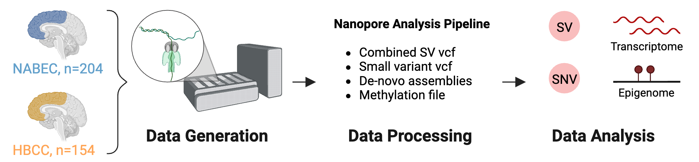

# **Long-read sequencing of hundreds of diverse brains provides insight into the impact of structural variation on gene expression and DNA methylation**

**Written By:** *Kimberley Billingsley, *Melissa Meredith, *Kensuke Daida

**Last Updated**: December 2024 

**Quick Description**: Assesing the impact of SNV and SV on gene expression and in the human brain using longread-seqeuncing data. 

**Link to Manuscript:** 

### **Background:**
Structural variants (SVs) drive gene expression in the human brain and are causative of many neurological conditions. However, most existing genetic studies have been based on short-read sequencing methods, which capture fewer than half of the SVs present in any one individual. Long-read sequencing (LRS) enhances our ability to detect disease-associated and functionally relevant structural variants (SVs); however, its application in large-scale genomic studies has been limited by challenges in sample preparation and high costs. Here, we leverage a new scalable wet-lab protocol and computational pipeline for whole-genome Oxford Nanopore Technologies sequencing and apply it to neurologically normal control samples from the North American Brain Expression Consortium (NABEC) (European ancestry) and Human Brain Collection Core (HBCC) (African or African admixed ancestry) cohorts. Through this work, we present a publicly available long-read resource from 351 human brain samples (median N50: 27 Kbp and at an average depth of ~40x genome coverage). We discover approximately 250,000 SVs and produce locally phased assemblies that cover 95% of all protein-coding genes in GRCh38. Utilizing matched expression datasets for these samples, we apply quantitative trait locus (QTL) analyses and identify SVs that impact gene expression in post-mortem frontal cortex brain tissue. Further, we determine haplotype-specific methylation signatures at millions of CpGs and, with this data, identify cis-acting SVs. In summary, these results highlight that large-scale LRS can identify complex regulatory mechanisms in the brain that were inaccessible using previous approaches. We believe this new resource provides a critical step toward understanding the biological effects of genetic variation in the human brain. 

### **Structure of README:**

**1.Variant calling and QC** 
1.1 
1.2 

**2. eQTL analyses** 
2.1 
2.2 

**3. Methyaltion analyses**

3.1 
3.2 

**4.  mQTL analyses**

4.1 
4.2 
